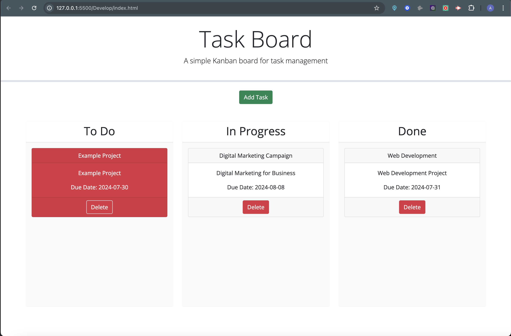

# Task Board Application

## Overview
Task Board in a Kanban-style task management web application that allows users to organize tasks into "To Do", "In Progress", and "Done" columns. Users can add, edit, delete, and drag-and-drop tasks between different status lanes. Task data is saved in the browser's localStorage to persist across sessions.

## Features

- **Add Tasks** : Create new tasks with a title, description, and due date.
- **Drag and Drop** : Move tasks between different status lanes.
- **Persistent Storage** : Tasks are stored in localStorage to maintain stat across page reloads.
- **Task Management** : Delete tasks easily.

## Setup 

- Clone or download the repository.
- Open the index.html file in a web browser. 
-Start adding tasks using the "Add Task" button.

## Technologies Used

- HTML, CSS (Bootstrap)
- Javascript (Jquery)
- Day.js for date handling 

